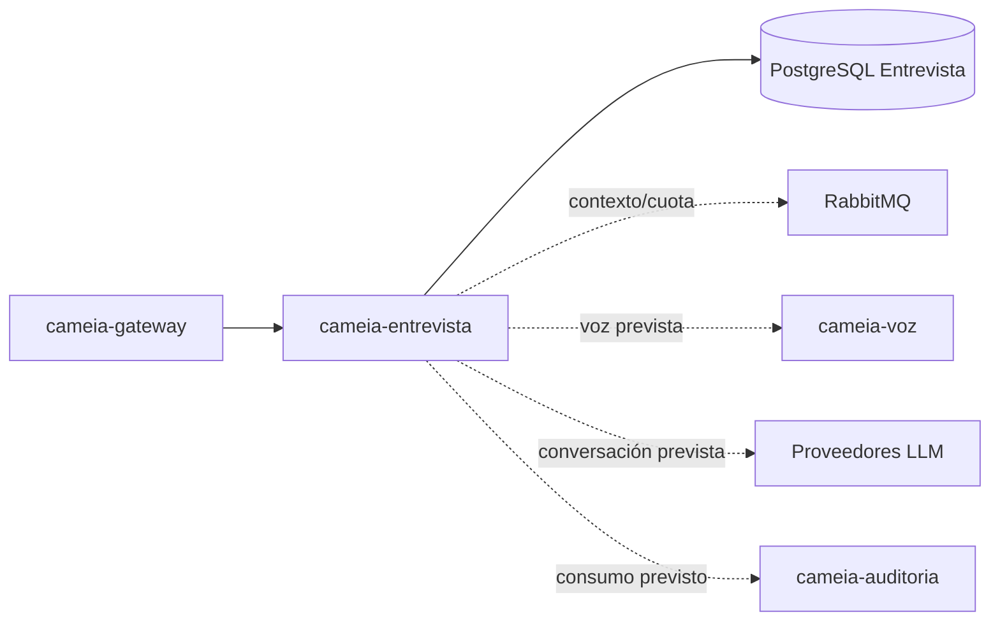

# cameia-entrevista

Microservicio central de Entrevista de CAMEIA. Gestiona la configuración, estado, preguntas y turnos de las sesiones de práctica.

## Responsabilidades

- Configurar e iniciar sesiones de entrevista con parámetros validados.
- Mantener la máquina de estados y sus invariantes (`CONFIGURADA`, `EN_CURSO`, `PAUSADA`, `FINALIZADA`, `ABANDONADA`).
- Gestionar preguntas, respuestas y avance de turnos según el flujo de sesión.
- Construir contexto conversacional respetando límites de cuota y privacidad.
- Integrarse con Perfil, Voz, Auditoría y proveedores LLM mediante contratos explícitos.

No persiste cuentas, perfiles maestros ni archivos de audio/video de forma permanente.

## Contexto arquitectónico



## Tecnología prevista

| Elemento | Línea base |
|---|---|
| Lenguaje | Java 21 |
| Framework | Spring Boot 4.1.1 |
| Build | Maven; wrapper pendiente de confirmar |
| Persistencia | PostgreSQL 16, base/rol propios |
| Mensajería | RabbitMQ para réplicas y consumo cuando sea aprobado |
| Ejecución objetivo | Servicio HTTP y consumidor en el mismo repositorio/imagen |

## Contratos y datos

- Identificador compartido entre contextos: `sessionId` (generado internamente) y `firebaseUid` (del usuario).
- La configuración de sesión es inmutable después de inicializar.
- El contexto de vacante es texto libre; no depende del servicio Post-MVP de Empleo.
- Las llamadas externas (LLM, Voz, Auditoría) deben respetar timeout, cuota, privacidad y trazabilidad.
- Eventos y cambios de estado deben ser idempotentes cuando se repliquen vía RabbitMQ.

## Ejecución local

```text
Instalación: pendiente de confirmar en CM-101
Pruebas: pendiente de confirmar en CM-101
Build: pendiente de confirmar en CM-101
Inicio: pendiente de confirmar en CM-101
Health check: pendiente de confirmar en CM-101
```

## Configuración y seguridad

- No guardar prompts completos sensibles, CV, audio, transcripciones, tokens ni `.env` en Git.
- No registrar datos personales en trazas de auditoría; conservar solo evidencia de consumo.
- Usar una base y un rol independientes de los demás microservicios.
- Validar que timeout, cuota e idempotencia se respeten en todas las integraciones externas.

## Calidad esperada

- Pruebas de transiciones válidas e inválidas de máquina de estados.
- Pruebas negativas para valores fuera de rango, configuración inválida y acceso no autorizado.
- Pruebas de reintentos, timeouts y fallos de proveedores (LLM, Voz, Auditoría).
- Pruebas de idempotencia para cambios de estado replicados vía RabbitMQ.
- CI con build, pruebas y validación de seguridad después de confirmar comandos reales.

## Contribución

- `main` es estable y solo recibe promociones `develop → main` mediante Merge commit.
- `develop` integra ramas `<tipo>/CM-NNN-<descripcion-kebab-case>` mediante Squash.
- Todo cambio ordinario entra mediante PR y revisión distinta del autor.

Tipos admitidos: `feat`, `fix`, `test`, `docs`, `refactor`, `perf`, `build`, `ci` y `chore`.
